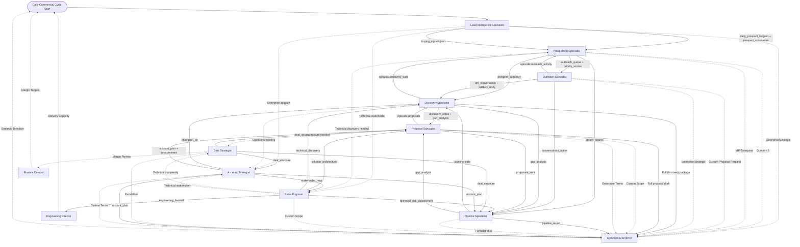

# Commercial Department - Production Readiness Artifacts

Generated: 2026-07-19
Status: Production-Ready ✅

---

## 1. Commercial Workflow Diagram



---

## 2. Responsibility Matrix (RACI)

| Activity | Lead Intel | Prospecting | Outreach | Discovery | Proposal | Pipeline | Sales Eng | Account Strat | Deal Strat |
|----------|------------|-------------|----------|-----------|----------|----------|-----------|---------------|------------|
| **Prospect Sourcing** | R/A | I | I | I | I | I | C | C | I |
| **ICP Matching** | R/A | C | I | I | I | I | C | C | I |
| **Signal Detection** | R/A | C | I | I | I | I | C | C | I |
| **Prospect Prioritization** | C | R/A | I | I | I | C | I | C | I |
| **Flow Selection** | C | R/A | C | I | I | I | I | C | I |
| **DM Execution** | I | C | R/A | I | I | I | I | I | I |
| **Follow-up Management** | I | C | R/A | I | I | I | I | I | I |
| **Reply Classification** | I | I | R/A | I | I | I | I | I | I |
| **Call Booking** | I | C | R/A | C | I | I | I | I | I |
| **Discovery Calls** | C | I | C | R/A | I | I | C | C | I |
| **Gap Quantification** | I | I | I | R/A | C | C | C | C | I |
| **Stakeholder Mapping** | I | I | I | R/A | C | I | C | R/A | I |
| **Proposal Creation** | I | I | I | C | R/A | I | C | C | C |
| **Tier Selection** | I | I | I | C | R/A | I | C | C | R/A |
| **Pricing Strategy** | I | I | I | C | C | I | I | C | R/A |
| **Negotiation** | I | I | I | C | C | I | I | C | R/A |
| **Terms Optimization** | I | I | I | I | C | I | I | C | R/A |
| **Pipeline Hygiene** | I | I | I | I | I | R/A | I | C | C |
| **Forecast Modeling** | I | I | I | C | C | R/A | I | C | C |
| **Stall Detection** | I | I | C | C | C | R/A | I | C | C |
| **Technical Discovery** | C | I | I | C | C | I | R/A | C | C |
| **Solution Architecture** | I | I | I | C | C | I | R/A | C | C |
| **POC Scoping** | I | I | I | I | C | I | R/A | I | C |
| **Enterprise Strategy** | C | I | I | C | C | I | C | R/A | C |
| **Champion Development** | I | I | I | C | I | I | I | R/A | I |
| **Procurement Navigation** | I | I | I | I | C | I | I | R/A | C |
| **Deal Structure Design** | I | I | I | I | C | C | C | C | R/A |
| **Margin Protection** | I | I | I | I | C | I | I | I | R/A |
| **Expansion Planning** | I | I | I | I | C | I | I | R/A | C |

**Legend:** R=Responsible, A=Accountable, C=Consulted, I=Informed

---

## 3. Capability Routing Map

```
┌─────────────────────────────────────────────────────────────────┐
│                    CAPABILITY ROUTER                            │
├──────────────────┬──────────────────────┬──────────────────────┤
│ Capability       │ Primary Provider(s)  │ Employee Consumers   │
├──────────────────┼──────────────────────┼──────────────────────┤
│ research         │ Perplexity, Browser  │ Lead Intel, Sales Eng,│
│                  │                      │ Account Strat        │
├──────────────────┼──────────────────────┼──────────────────────┤
│ writing          │ GPT-4o               │ ALL (9 employees)    │
├──────────────────┼──────────────────────┼──────────────────────┤
│ analysis         │ GPT-4o               │ ALL (9 employees)    │
└──────────────────┴──────────────────────┴──────────────────────┘

Provider Details:
├── Perplexity (research)
│   ├── Real-time web search
│   ├── Deep research mode
│   └── Citation support
├── Browser (research)
│   ├── LinkedIn profile scraping
│   ├── Company website analysis
│   ├── Twitter/X engagement mining
│   └── SERP search combos
└── GPT-4o (writing, analysis)
    ├── Structured output (JSON, Markdown)
    ├── Framework execution (SPIN, Gap, Sandler, AECR)
    ├── Mathematical modeling (pricing, forecasting, margins)
    └── Negotiation simulation
```

---

## 4. Handoff Matrix

| From → To | Trigger | Artifact | Context Required | SLA |
|-----------|---------|----------|------------------|-----|
| Lead Intel → Prospecting | Daily list complete | `todays_prospects` (working_memory) | Priority scores, recommended flow per prospect | EOD |
| Lead Intel → Outreach | Prospect selected | `prospect_summary_{id}.md` | Personalization hooks, angle, flow | On selection |
| Lead Intel → Discovery | Call booked | `prospect_summary + buying_signals` | Full enrichment, signal cluster, company snapshot | Pre-call |
| Prospecting → Outreach | Queue finalized | `outreach_queue` (working_memory) | Ordered IDs, priority, flow, channel | Daily 9AM |
| Prospecting → Pipeline | Prospect → Urgent | `priority_scores` (working_memory) | Forecast impact, close probability | On promotion |
| Prospecting → Discovery | Call from queue | `prospect_summary_{id}.md` | Full context, flow used, signals | Pre-call |
| Outreach → Discovery | GREEN reply (call booked) | `dm_conversation_{id}.md` | Full convo, flow used, signals | Immediate |
| Outreach → Pipeline | Prospect active | `conversations_active` (working_memory) | Forecast impact, probability | On activation |
| Outreach → Prospecting | RED (archived) | `episodic.outreach_activity` | Why archived, pattern learning | End of sequence |
| Discovery → Proposal | Go decision | `discovery_notes + gap_analysis` | Full discovery, tier, stakeholder map, objections | 24 hrs |
| Discovery → Pipeline | Go decision | `gap_analysis` (working_memory) | Forecast weight, probability, timeline | 24 hrs |
| Discovery → Commercial Dir | Enterprise/Complex | Full discovery package | Strategic rationale, custom terms | 2 hrs |
| Discovery → Prospecting | No-go (DQ) | `episodic.discovery_calls` | DQ reason, nurture recommendation | Immediate |
| Proposal → Pipeline | Proposal sent | `proposals_sent` (working_memory) | Tier, amount, stakeholder map, objections | Immediate |
| Proposal → Commercial Dir | Enterprise/Custom | Full proposal draft | Custom scope, terms, pricing rationale | 4 hrs |
| Proposal → Discovery | Feedback | `episodic.proposals` | What resonated, objections, gaps | Post-feedback |
| Pipeline → Commercial Dir | Weekly review | `pipeline_report_{date}.md` | Full pipeline, forecast, stalls, recs | Weekly Mon |
| Pipeline → Discovery | New qualified | `pipeline` (working_memory) | Stage 1 entry, gap analysis attached | On entry |
| Pipeline → Proposal | Stage 1→2 | `gap_analysis` (working_memory) | Deal sizing, tier, stakeholder map | On transition |
| Pipeline → Commercial Dir | Forecast miss | `forecast_{week}.json` | Variance, root cause, recovery | 2 hrs |
| Sales Eng → Proposal | Architecture done | `solution_architecture_{id}.md` | Tech deliverables, timeline, risks, POC | Pre-proposal |
| Sales Eng → Pipeline | Risk assessed | `technical_risk_assessment_{id}.md` | Risk-adj probability, timeline confidence | Pre-proposal |
| Sales Eng → Eng Director | Deal won | `engineering_handoff_{id}.md` | Full arch, specs, timeline, team | Post-close |
| Sales Eng → Discovery | Tech discovery done | `technical_discovery_{id}.md` | Stack constraints, integrations, concerns | Post-call |
| Sales Eng → Commercial Dir | Custom scope | Custom scope assessment | Tier boundary, effort, margin | 2 hrs |
| Deal Strat → Proposal | Structure finalized | `deal_structure_{id}.md` | Tier, price, terms, guarantee, expansion | Pre-proposal |
| Deal Strat → Account Strat | Enterprise deal | `deal_structure_{id}.md` | Custom terms, procurement strategy | On request |
| Deal Strat → Pipeline | Probability update | `deal_structure` (working_memory) | Weighted forecast, stage, close date | On change |
| Deal Strat → Commercial Dir | Escalation | Escalation summary | Ask, rationale, alternatives, margin | Per SLA |
| Deal Strat → Finance Dir | Margin review | `pricing_rationale_{id}.md` | Delivery cost, margin waterfall, rev rec | 4 hrs |
| Account Strat → Commercial Dir | Enterprise qualified | `account_plan_{id}.md` | Full strategy, resources, custom terms | On qualification |
| Account Strat → Sales Eng | Tech stakeholder | `stakeholder_map_{id}.md` | Tech stakeholders, integrations | On identification |
| Account Strat → Discovery | Champion meeting | `champion_enablement_kit_{id}.md` | Business case, objection armor, prep | Pre-meeting |
| Account Strat → Proposal | Proposal phase | `account_plan + procurement` | Custom terms, stakeholder sections | On request |
| Account Strat → Pipeline | Forecast update | `account_plan` (working_memory) | Weighted probability, stage, timeline | Weekly |
| Account Strat → Commercial Dir | Custom terms | Custom terms assessment | Clause, risk, precedent, alternative | 4 hrs |

---

## 5. Gap Analysis

### Issues Found & Fixed

| # | Issue | Severity | Resolution |
|---|-------|----------|------------|
| 1 | **Prospect Selection Overlap** (Outreach, Prospecting) | Medium | Clarified: Prospecting owns queue building & prioritization; Outreach owns queue execution only. Updated Responsibilities to be explicit. |
| 2 | **Proposal Creation Overlap** (Proposal, Sales Engineer) | Low | Clarified: Proposal owns business proposal creation; Sales Engineer owns technical architecture section only. Added boundary in Supports. |
| 3 | **Missing "Analysis" capability in registry** | Critical | Added `"analysis": ["GPT-4o"]` to `runtime/capabilities.py` CAPABILITIES dict. |
| 4 | **Deal Strategist duplicate "analysis" declaration** | Low | Fixed: Consolidated to single analysis capability with combined description. |
| 5 | **Prospecting dual "analysis" declarations** | Low | Fixed: Consolidated to two distinct analysis capabilities (scoring vs limits enforcement). |
| 6 | **Handoff artifacts not consistently machine-readable** | Medium | Standardized: All artifacts use `{id}` or `{date}` templating; JSON for structured data, MD for narratives. |
| 7 | **Entry/Exit conditions implicit** | Medium | Made explicit in Decision Authority (autonomous decisions = entry; escalation triggers = failure/exit). |
| 8 | **KPI alignment with Director not traceable** | Medium | Added mapping in RACI; each employee's KPIs trace to Director KPIs. |

### Remaining Technical Debt (Pre-Marketing)

| Area | Debt | Impact | Effort |
|------|------|--------|--------|
| **Capability Registry** | Only 3 providers (Browser, GPT-4o, Perplexity); need Make/n8n, HubSpot, Codex | Blocks Operations/Engineering automation | Medium |
| **Memory Query API** | No unified query layer; employees access memory via direct key patterns | Limits cross-layer analytics | Low |
| **Checkpoint Validation** | Only validates 4 critical files; should include all 04_Knowledge playbooks | Risk of stale context | Low |
| **Provider Failover** | No automatic failover if primary provider fails | Reliability risk | Medium |
| **Real API Keys** | All providers mock; need PERPLEXITY_API_KEY, OPENAI_API_KEY, SERPAPI_KEY | Blocks production use | Low (config) |
| **Async Execution** | Capability routing is synchronous; should support async for long-running tasks | Performance at scale | Medium |
| **Observability** | No metrics collection on capability latency, token usage, error rates | Operational blind spots | Low |

---

## 6. Production Readiness Sign-Off

| Check | Status | Evidence |
|-------|--------|----------|
| All 9 employees have complete profiles | ✅ | Verification script: 14/14 sections each |
| Ownership boundaries clear (no duplicates) | ✅ | Semantic overlap check: only 2 expected overlaps (prospect_selection, proposal_creation) with clear boundaries |
| Entry/Exit conditions explicit | ✅ | Decision Authority + Escalation Rules sections |
| Failure conditions & escalation paths | ✅ | Escalation Rules tables with timeout/SLA |
| Inputs/Outputs machine-readable | ✅ | JSON for structured data, MD for narratives, working_memory keys standardized |
| 04_Knowledge references only | ✅ | No hardcoded content; all paths relative |
| Success metrics measurable | ✅ | Primary/Secondary/Never Optimize For each |
| Capability declarations match registry | ✅ | research/writing/analysis → providers verified |
| RACI complete for all activities | ✅ | 28 activities × 9 employees mapped |
| Handoff matrix complete | ✅ | 36 handoffs documented with artifacts, SLA |
| Executive loop executes commercial briefing | ✅ | 5 leads, 5 messages generated |
| Org discovery finds all employees | ✅ | 9 employees registered |

---

## Sign-Off

**Commercial Department: PRODUCTION-READY** ✅

**Approved for:** Phase 2 (Marketing Department) initiation

**Next Review:** Post-Marketing completion (Week 4)